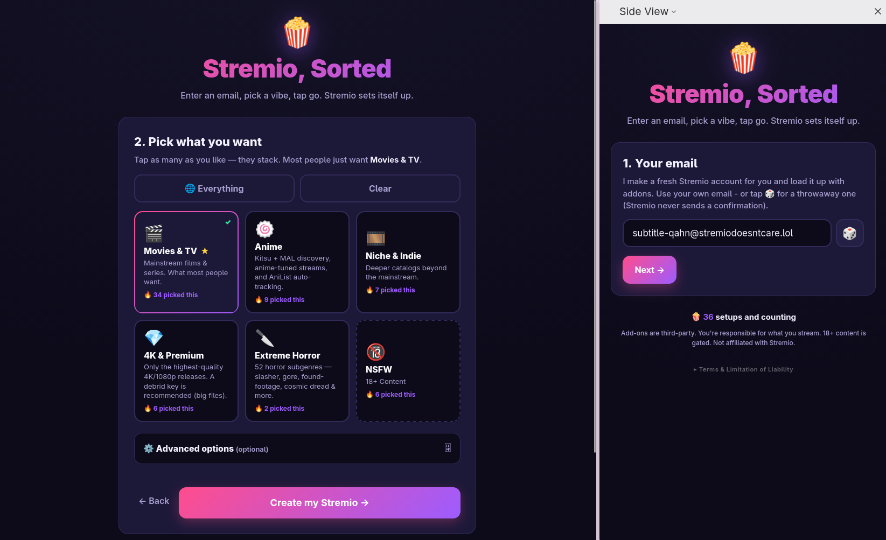
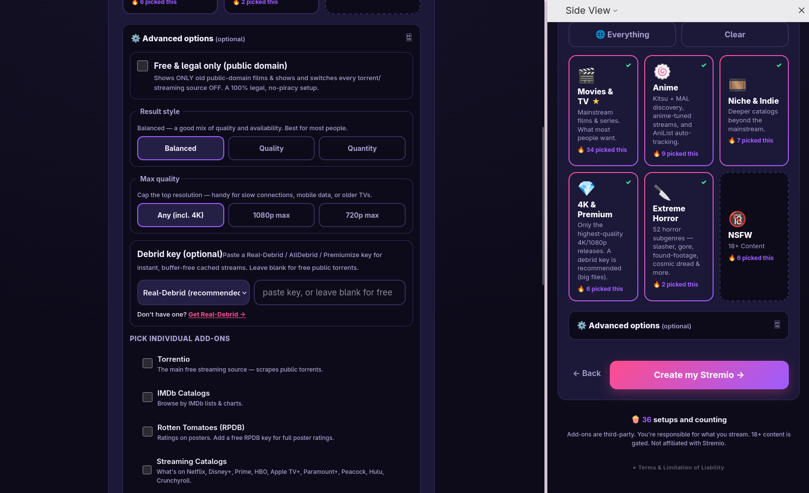
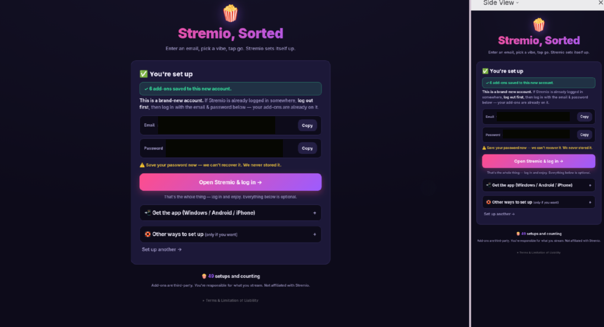
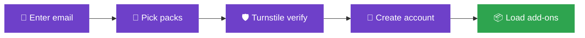

<div align="center">

# 🍿 stremio-setup.madebytrap.lol


A streamlined, one-tap configuration tool for Stremio. Whether you are setting it up for yourself or helping friends and family who aren't tech-savvy, this handles the heavy lifting. Just enter an email (or let it generate a random one), select your content packs, and tap go. The tool automatically creates the account and pre-loads all the selected add-ons. 

No more manually configuring Stremio accounts one add-on at a time.

> ⚠️ **AI Disclaimer:** Parts of this project (including code, documentation, and/or assets) were developed with the assistance of AI tools. Review and use accordingly.

### 🔗 [**stremio-setup.madebytrap.lol**](https://stremio-setup.madebytrap.lol)


</div>

<br>selection

<table>
<tr>
<td width="50%" valign="top">

### Core Features

- 📧 **Frictionless Setup** - Type an email, pick your preferred content packs, and you are ready to stream.
- 🔒 **Total Privacy (Client-Side)** - Your email and generated password communicate directly with Stremio (`api.strem.io`). Your credentials never touch our servers.
- 🛡️ **Invisible Security** - Protected by Cloudflare Turnstile and strict per-IP rate limits to block bots without annoying users.
- 🎛️ **Single Source of Truth** - All add-ons, packs, and baseline configurations are managed via a single JSON file for effortless updates.

</td>
<td width="50%" valign="top">

<br>
<br>
</td>
</tr>
</table>

<br>

## How it works



> `C`→`D` is the only hop that leaves the browser. The Turnstile verification and rate-limiting go through our sidecar service to ensure security.

> The actual account creation (`D`) communicates securely and directly from your browser to `api.strem.io`—see Architecture below.

---

## Architecture

* **Frontend** (this dir, static): The setup wizard and **client-side** account creation logic. Emails and generated passwords are sent straight from the user's browser to `api.strem.io`. They **never touch our server** (Verified: Stremio API + addon hosts successfully send `Access-Control-Allow-Origin: *`).
* **Sidecar**: `stremio-setup-svc` — Handles Turnstile verification, per-IP rate-limiting, and the live "pack setup" counter. No personally identifiable information (PII) is processed here.
* **Edge**: Caddy block for `stremio-setup.madebytrap.lol` (static + `/api/*` routed to the sidecar).

## Configuration & Management

`public/data/stremio-addons.json` is the control center. Edit and redeploy to update the site instantly.
`addons` are defined once globally; `packs` reference them by their ID; `baseline` dictates what is always installed; `defaults.remove` cleanly strips out any unwanted default Stremio add-ons.

### Adding or fixing an add-on

1. Drop the add-on's `manifest` URL into its designated entry.
2. Remove `needs_url: true` (and `configure_url`) so the add-on automatically applies in the background, rather than prompting the user with a "Configure & install" link.

---

## Content Categories (Verified 2026-06-26)

Each pack has been tested end-to-end: catalogs successfully load items, and titles successfully pull playable streams.

| Preset | How it Works | Notes |
| --- | --- | --- |
| 🎬 Movies & TV | Streaming Catalogs + Torrentio (50 streams) | The default recommendation |
| 🍥 Anime | Kitsu/MAL catalogs + Torrentio-Anime (50 streams) + AniList tracking |  |
| 🎞️ Niche & Indie | Torrent Catalogs + baseline Torrentio |  |
| 💎 4K & Premium | Torrentio tuned exclusively to 1080p+ and 4K | Debrid highly recommended for large files |
| 🔪 Extreme Horror | Scary Only (52 subgenre catalogs) + Torrentio (50 streams) |  |

---

## Run locally

To test the static frontend locally, simply serve the repository root using any static file server:

```sh
npx serve .
# or
npx http-server .
# or, utilizing Python
python3 -m http.server

```

Then open the provided local URL (e.g., `http://localhost:8000`).

*Note: A full production deployment (which includes Turnstile verification, rate-limiting, and the live tally) requires the sidecar and edge configuration to be running.*

---

## Tech stack

| Dependency | Purpose | License |
| --- | --- | --- |
| [Cloudflare Turnstile](https://developers.cloudflare.com/turnstile/) | Bot-check widget, loaded safely via Cloudflare's CDN | Proprietary (Cloudflare) |
| [api.strem.io](https://github.com/Stremio/stremio-api) | Facilitates direct client-side account creation and add-on installation | Third-party, Stremio |
| Vanilla JS (`public/js/app.js`) | Core wizard logic, keeping things fast with zero framework bloat | - |

The Cloudflare Turnstile script is the only third-party network dependency loaded at runtime. Everything else operates purely via plain HTML/CSS/JS communicating directly with Stremio's public API.

## Directory Structure

```
├── index.html
├── public/
│   ├── css/app.css
│   ├── js/app.js
│   └── data/
│       └── stremio-addons.json
├── custom/
│   └── addons/thelist/
└── docs/screenshots/

```

---

## Licensing

| Scope | License |
| --- | --- |
| Code (HTML/CSS/JS) written for this project | [GNU AGPLv3](https://www.gnu.org/licenses/agpl-3.0.en.html) |
| Content - copy, branding, curated add-on lists | © Trap, all rights reserved |

> **Note:** The AGPLv3 license covers the codebase only.

## Disclaimer

This project is provided for **educational and entertainment purposes only**. It does not host, distribute, or serve any copyrighted content. It functions strictly to automate the configuration of third-party Stremio add-ons that are already publicly available on the internet. The maintainer(s) assume no responsibility or liability for how this tool is utilized, nor for the content, legality, or availability of any third-party add-ons or media streams accessed through it. Use at your own risk and strictly in accordance with your local laws.

```