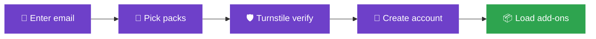

<div align="center">

# 🍿 stremio-setup.madebytrap.lol


Self-service Stremio setup. Visitor enters their own email or generates one randomly, picks packs, taps go - the page creates a Stremio account and loads the add-ons.

No more setting up accounts by hand for the less tech savy.

> ⚠️ **AI Disclaimer:** Parts of this project (including code, documentation, and/or assets) were developed with the assistance of AI tools. Review and use accordingly.

### 🔗 [**stremio-setup.madebytrap.lol**](https://stremio-setup.madebytrap.lol)


</div>

<br>

<table>
<tr>
<td width="50%" valign="top">

### Features

- 📧 **Self-service** - enter or generate an email, pick packs, done
- 🔒 **Client-side account creation** - email + generated password go straight to `api.strem.io`, never touch our server
- 🛡️ **Bot-gated** - Cloudflare Turnstile + per-IP rate limit in front of setup
- 🎛️ **One JSON source of truth** - addons/packs/baseline defined once, edit + redeploy

</td>
<td width="50%" valign="top">

<br>
<br>
</td>
</tr>
</table>

<br>

## How it works



> `C`→`D` is the only hop that leaves the browser: Turnstile verify + rate-limit go through the sidecar. 

>Account creation itself (`D`) talks directly to `api.strem.io` from the client - see Architecture below.

---

## Architecture

- **Frontend** (this dir, static): the whole wizard + **client-side** account creation. Email + a generated password go straight from the browser to `api.strem.io` and **never touch our server** (verified: Stremio API + addon hosts all send `Access-Control-Allow-Origin: *`).
- **Sidecar**: `stremio-setup-svc` — Turnstile verify + per-IP rate-limit + the public "fun" pack tally. No PII.
- **Edge**: Caddy block for `stremio-setup.madebytrap.lol` (static + `/api/*` → sidecar).

## Single source of truth

[`public/data/stremio-addons.json`](public/data/stremio-addons.json). Edit + redeploy. `addons` are defined once; `packs` reference them by id; `baseline` is always-on; `defaults.remove` strips unwanted Stremio default add-ons.

### Add / fix an add-on
1. Drop its `manifest` URL into the addon entry.
2. Remove `needs_url: true` (and `configure_url`) so it auto-applies instead of showing as a "Configure & install" link-out.

---

## Categories (6, all functionally verified 2026-06-26)

Each was tested end-to-end: catalogs return items AND titles return playable streams.

| Preset | Works because | Notes |
|---|---|---|
| 🎬 Movies & TV | Streaming Catalogs + Torrentio (50 streams) | the default |
| 🍥 Anime | Kitsu/MAL catalogs + Torrentio-Anime (50 streams) + AniList tracking | |
| 🎞️ Niche & Indie | Torrent Catalogs + baseline Torrentio | |
| 💎 4K & Premium | Torrentio tuned to 1080p+/4K only | debrid recommended (big files) |
| 🔪 Extreme Horror | Scary Only (52 subgenre catalogs) + Torrentio (50 streams) | |
| 🔞 Adult | Hentai (direct), TPB/AdultStremio/PornTube (torrent/debrid), cams (configure) | age-gated |

---

## Run locally

Static frontend only - serve the repo root with any static file server:

```sh
npx serve .
# or
npx http-server .
# or, if you have Python installed
python3 -m http.server
```

Then open the printed local URL (e.g. `http://localhost:8000`).

Full production deploy (Turnstile verification, rate-limiting, the live tally) needs the sidecar + edge config migrated in first.

---

## Tech stack

| Dependency | Purpose | License |
| ---------- | ------- | ------- |
| [Cloudflare Turnstile](https://developers.cloudflare.com/turnstile/) | Bot-check widget, loaded from Cloudflare's CDN | proprietary (Cloudflare) |
| [api.strem.io](https://github.com/Stremio/stremio-api) | Direct client-side account creation + add-on install | third-party, Stremio |
| Vanilla JS (`public/js/app.js`) | Wizard logic, no framework | - |

Turnstile's widget script is the only third-party network dependency at runtime - everything else in the wizard is plain HTML/CSS/JS talking straight to Stremio's public API.

## Structure

```
├── index.html
├── public/
│   ├── css/app.css
│   ├── js/app.js
│   └── data/
│       └── stremio-addons.json
├── custom/
│   └── addons/thelist/
└── docs/screenshots/
```

---

## Licensing

| Scope                                        | License                                  |
| --------------------------------------------- | ----------------------------------------- |
| Code (HTML/CSS/JS) written for this project   | [GNU AGPLv3](LICENSE)                    |
| Content - copy, branding, curated add-on lists | © Tristan Phillips, all rights reserved  |

> Not covered by the code license; no reuse of copy, branding, or the curated add-on lists without permission.

## Disclaimer

This project is provided for **educational and entertainment purposes only**. It does not host, distribute, or serve any copyrighted content itself - it merely automates configuration of third-party Stremio add-ons that are publicly available. The maintainer(s) assume no responsibility or liability for how this tool is used, or for the content, legality, or availability of any third-party add-ons or streams accessed through it. Use at your own risk and in accordance with your local laws.
